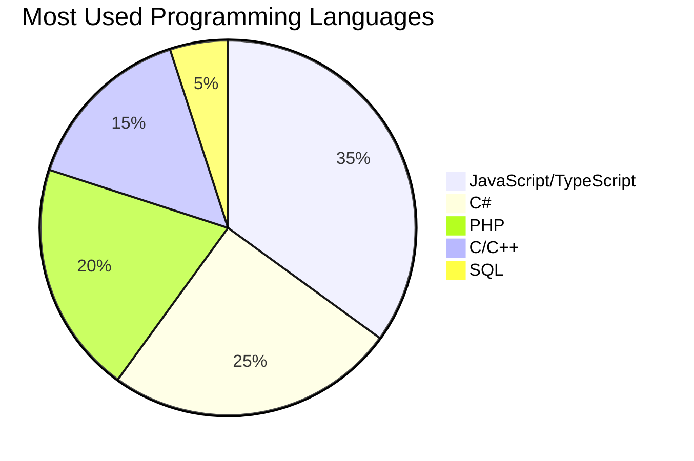

# <div align="center">👋 Xin chào, tôi là Marcus Phạm</div>

<div align="center">
  
</div>

---

## 🎯 Thông tin cá nhân | Personal Information | 个人信息

<table>
<tr>
<td width="50%">

**🇻🇳 Tiếng Việt:**
- 📛 **Tên:** Phạm Minh Quang
- 🎓 **Chuyên ngành:** Truyền thông mạng máy tính
- 🏫 **Trường:** ĐH Hàng Hải Việt Nam
- 📍 **Khoa:** Công nghệ thông tin
- 🌟 **Cung hoàng đạo:** Bạch Dương ♈
- 💝 **Tình trạng:** Có người yêu (Sunny Vũ)

</td>
<td width="50%">

**🇺🇸 English:**
- 📛 **Name:** Marcus Phạm
- 🎓 **Major:** Network Communication
- 🏫 **University:** Vietnam Maritime University
- 📍 **Faculty:** Information Technology
- ⚽ **Idol:** Thibaut Courtois
- 🌐 **Languages:** IELTS certified, HSK 2 (Chinese)

</td>
</tr>
</table>

**🇨🇳 中文:** 范明光 | 网络通信专业 | 越南海事大学信息技术学院

---

## 🚀 Ngôn ngữ lập trình | Programming Languages

<div align="center">


</div>

---

## 🛠️ Frameworks & Libraries

<div align="center">

### Frontend Frameworks


### Backend Frameworks


### UI Libraries


### Build Tools
 ⭐ **Special Love**

</div>

---

## 💻 IDE & Development Tools

<div align="center">


</div>

---

## 🤖 AI Tools & Assistants

<div align="center">


</div>

---

## 📊 Programming Languages Usage



---

## 📈 Commit Activity

```mermaid
gitgraph
    commit id: "Initial commit"
    commit id: "Add React components"
    commit id: "Implement API endpoints"
    branch feature/ui-update
    commit id: "Update UI components"
    commit id: "Add Tailwind styling"
    checkout main
    merge feature/ui-update
    commit id: "Deploy to production"
    commit id: "Bug fixes"
    commit id: "Performance optimization"
```

---

## 🏆 Achievements & Skills

<div align="center">

### 🌐 Languages


### 💼 Current Role


</div>

---

## ⚽ Interests & Hobbies

<div align="center">

🌟 **Extrovert** • ⚽ **Football Fan** • 🥅 **Courtois Supporter** • 🌍 **Travel Enthusiast** • 💕 **In Love with Sunny Vũ**

</div>

---

## 📫 Connect with Me

<div align="center">

[](https://linkedin.com/in/marcuspham)
[](https://github.com/marcuspham)
[](mailto:marcuspham@example.com)

</div>

---

## 📊 GitHub Stats

<div align="center">
  
  
</div>

<div align="center">
  
</div>

---

<div align="center">
  
  ### 💭 Inspiration
  
  *"Innovation distinguishes between a leader and a follower."*
  
  **— Steve Jobs**
  
  ---
  
  
  
  **✨ Made with ❤️ by Marcus Phạm | 范明光 ✨**
  
</div>
