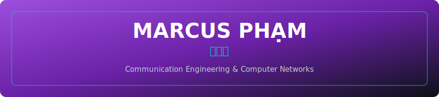
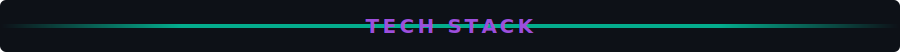
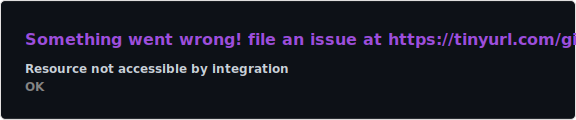
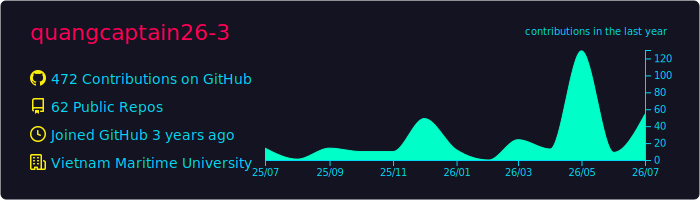
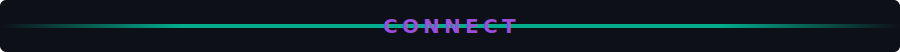

 

 

  
  
  
  

<!-- ─── ABOUT ─── -->

> *I don't claim to know it all.*
>
> I'm just someone who tries to learn a little more each day — and become a bit better than I was yesterday.

 

Hi, I'm **Marcus Phạm** (范明光), a graduate of **Communication Engineering and Computer Networks** at **Vietnam Maritime University**. I enjoy working with networks, building software, and picking up whatever helps me grow along the way.

 

| | |
|:---:|:---:|
|  |  |
|  |  |

<!-- ─── TECH STACK ─── -->

 

  

  
  
  
  
  

  

  
  
  
  
  

  

  
  
  
  
  

<!-- ─── GITHUB ACTIVITY ─── -->

<picture>
  <source media="(prefers-color-scheme: dark)" srcset="./assets/github-contribution-grid-snake-dark.svg" />
  
</picture>

  

| | |
|:---:|:---:|
|  |  |
|  |  |

 

<!-- ─── CONNECT ─── -->

 

